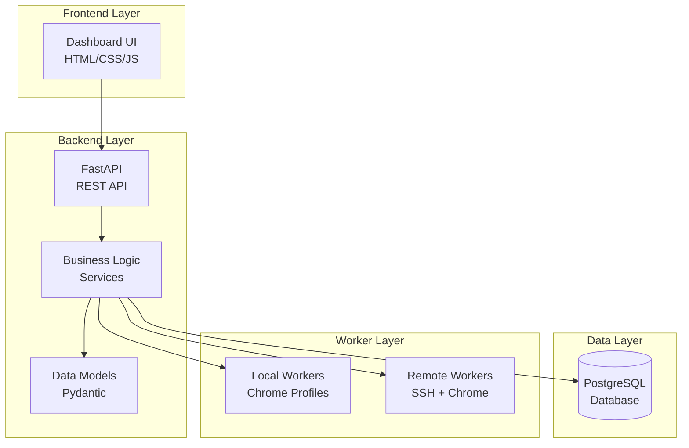
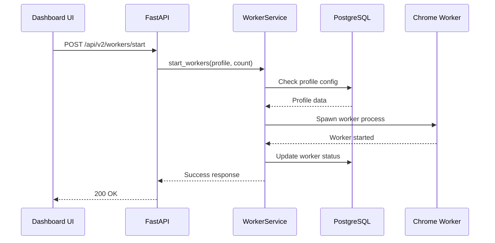
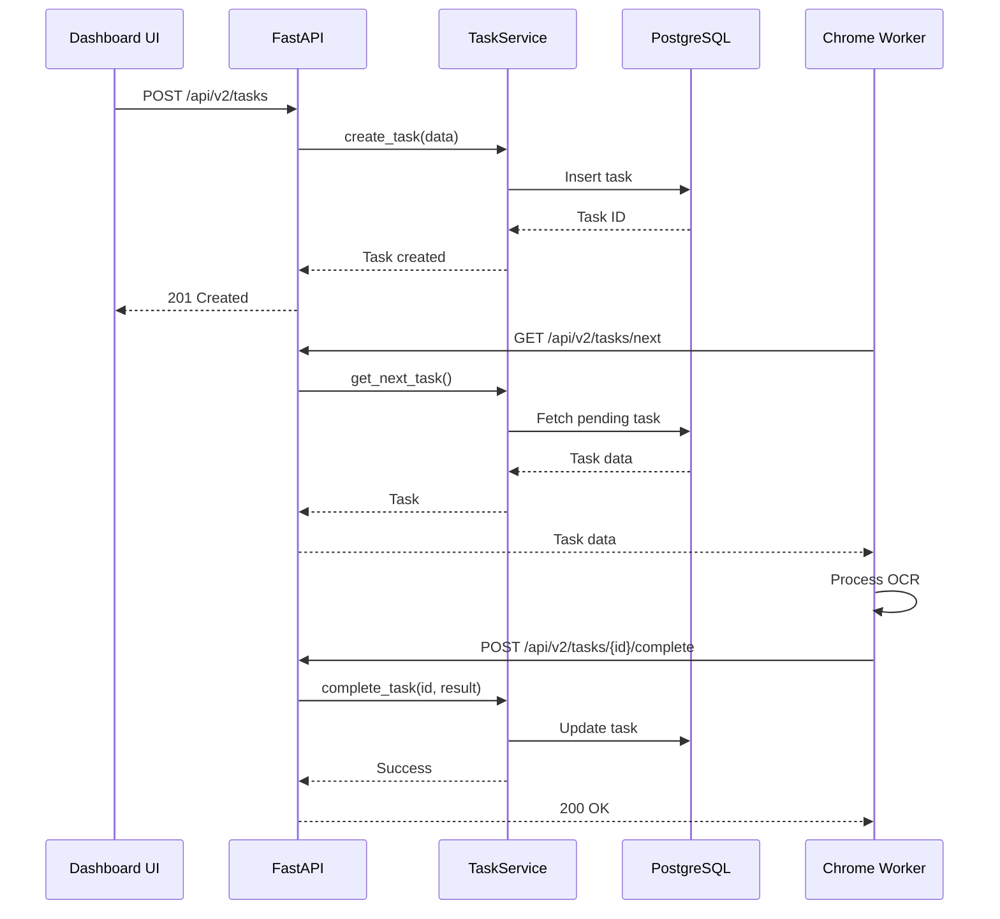

# Architektura OCR Dashboard V2

## Przegląd Architektury

OCR Dashboard V2 wykorzystuje architekturę trójwarstwową z wyraźnym podziałem na warstwy prezentacji, logiki biznesowej i danych.



## Komponenty Systemu

### 1. Frontend (Dashboard UI)

**Lokalizacja**: `static/`, `templates/`

**Technologie**:
- Vanilla JavaScript
- Custom CSS
- Client-side routing

**Odpowiedzialności**:
- Wyświetlanie interfejsu użytkownika
- Komunikacja z API backend
- Zarządzanie stanem UI
- Routing między widokami

**Kluczowe pliki**:
- `static/js/app.js` - Główna logika aplikacji
- `static/css/style.css` - Stylowanie
- `templates/index.html` - Główny template

### 2. Backend API (FastAPI)

**Lokalizacja**: `app/`

**Technologie**:
- FastAPI framework
- Uvicorn ASGI server
- Pydantic dla walidacji

**Odpowiedzialności**:
- Obsługa HTTP requests
- Walidacja danych wejściowych
- Routing do odpowiednich services
- Generowanie odpowiedzi API

**Struktura**:

```
app/
├── main.py              # FastAPI app initialization
├── config.py            # Configuration management
└── routes/
    ├── workers.py       # Workers endpoints
    ├── profiles.py      # Profiles endpoints
    └── tasks.py         # Tasks endpoints
```

**Przykładowe endpoints**:
- `GET /api/v2/workers/status` - Status workers
- `POST /api/v2/workers/start` - Start workers
- `POST /api/v2/workers/stop` - Stop workers
- `GET /api/v2/profiles` - Lista profili

### 3. Business Logic (Services)

**Lokalizacja**: `app/services/`

**Odpowiedzialności**:
- Implementacja logiki biznesowej
- Zarządzanie workers i profilami
- Komunikacja z bazą danych
- Komunikacja z remote workers

**Kluczowe services**:

#### WorkerService
- Uruchamianie/zatrzymywanie workers
- Monitorowanie statusu workers
- Zarządzanie lifecycle workers

#### ProfileService
- Zarządzanie profilami Chrome
- Synchronizacja profili
- Walidacja konfiguracji profili

#### TaskService
- Kolejkowanie zadań OCR
- Przypisywanie zadań do workers
- Śledzenie postępu

### 4. Data Layer (PostgreSQL)

**Technologie**:
- PostgreSQL database
- asyncpg driver
- SQLAlchemy (opcjonalnie)

**Schema**:

```sql
-- Workers
CREATE TABLE workers (
    id SERIAL PRIMARY KEY,
    profile_name VARCHAR(255),
    status VARCHAR(50),
    started_at TIMESTAMP,
    last_heartbeat TIMESTAMP
);

-- Profiles
CREATE TABLE profiles (
    id SERIAL PRIMARY KEY,
    name VARCHAR(255) UNIQUE,
    proxy_config JSONB,
    user_agent TEXT,
    is_remote BOOLEAN
);

-- Tasks
CREATE TABLE tasks (
    id SERIAL PRIMARY KEY,
    worker_id INTEGER REFERENCES workers(id),
    status VARCHAR(50),
    created_at TIMESTAMP,
    completed_at TIMESTAMP,
    result JSONB
);
```

### 5. Worker Layer

**Typy workers**:

#### Local Workers
- Uruchamiane lokalnie na tym samym serwerze co dashboard
- Bezpośredni dostęp do profili Chrome
- Szybsza komunikacja

#### Remote Workers
- Uruchamiane na zdalnych serwerach
- Komunikacja przez SSH
- Skalowalne rozwiązanie

**Komunikacja**:
- REST API calls do dashboard
- Heartbeat mechanism
- Task polling lub WebSocket (opcjonalnie)

## Przepływ Danych

### Uruchomienie Workers



### Przetwarzanie Zadania OCR



## Wzorce Projektowe

### 1. Service Layer Pattern
Separacja logiki biznesowej od API endpoints

### 2. Repository Pattern
Abstrakcja dostępu do danych (opcjonalnie)

### 3. Dependency Injection
FastAPI dependency injection dla services i database connections

### 4. Configuration Management
Centralna konfiguracja przez environment variables

## Bezpieczeństwo

- **API Authentication**: Planowane (obecnie brak)
- **HTTPS**: Zalecane dla production
- **Database**: Connection pooling, prepared statements
- **Workers**: Izolacja procesów, resource limits

## Skalowalność

### Horizontal Scaling
- Dodawanie remote workers na nowych serwerach
- Load balancing dla API (opcjonalnie)

### Vertical Scaling
- Zwiększanie liczby workers per serwer
- Optymalizacja database queries

## Monitoring i Logging

- **Application logs**: `logs/` directory
- **Worker logs**: Per-worker log files
- **Database logs**: PostgreSQL logs
- **Metrics**: Planowane (Prometheus/Grafana)
